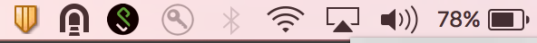
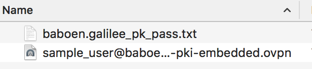

# Table of Contents

* [OSX](#osx)
    * [Install Tunnelblick](#install-tunnelblick)
    * [OpenVPN Credentials](#openvpn-credentials)
    * [Connecting to OpenVPN Server](#connecting-to-openvpn-server)

----

# OSX

## Install Tunnelblick

Tunnelblick is a free, open source graphic user interface for OpenVPN on OS X and macOS. It provides easy control of OpenVPN client and/or server connections. You can install the package as you would normally install an Application in OSX.  

Download the latest stable release in https://tunnelblick.net/downloads.html  

You should see an icon of it if the installation is successful.  

## OpenVPN Credentials

The openvpn configuration is composed of a `.ovpn` file and a password.  

This must be generated by the OpenVPN administrator.  

## Connecting to OpenVPN Server

__Step 1__ - Drag the `.ovpn` file in the Tunnelblick icon.  
__Step 2__ - You may have to enter your `OSX User password` after doing `Step 1`.  
__Step 3__ - Right click the icon and then click `Connect` to the configuration that was added from `Step 1`.  
__Step 4__ - Enter the `OpenVPN password`, the password is in the password `.txt` file.  

